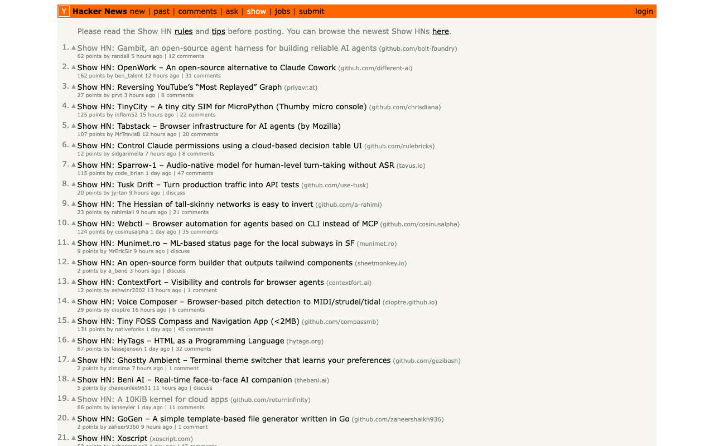
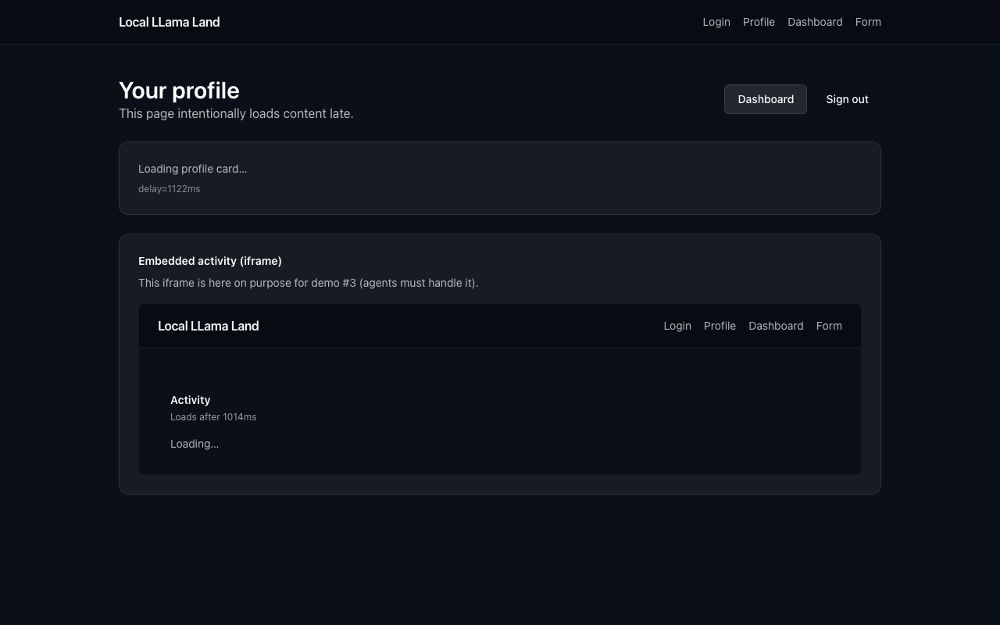
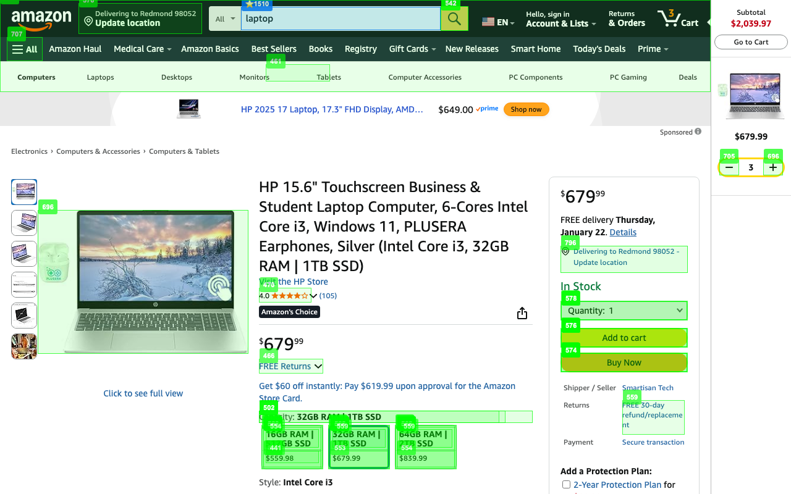

# 🤖 Sentience SDK Playground

**Reproducible demos showing how structure-first browser agents outperform vision-only agents.**

This repository contains **8 real-world browser agent demos** that run using:

* **Semantic geometry snapshots (DOM-based, not vision)**
* **Jest-style AgentRuntime assertions**
* **6 of these 8 demos use local-first inference (Qwen 2.5 3B)**
* **`amazon_shopping` and `google_search` use cloud LLM models for comparison**
* **Optional vision fallback only after exhaustion**

> **TL;DR**
>
> * ✅ 100% task success across all demos
> * 💸 ~50% lower token usage per step
> * 🧠 Works with small local models (3B–7B)
> * ❌ Vision-only agents fail systematically on the same tasks

---

## 🎯 What This Repo Is

This is a **playground + benchmark** for developers evaluating:

* browser agents
* local LLM execution
* deterministic web automation
* flaky UI handling
* assertion-driven verification

Each demo includes:

* runnable code
* logs
* screenshots
* optional video artifacts
* token accounting

---

## 🧪 Canonical Demos (Start Here)

### 🥇 Demo 1: News List Skimming (Hacker News)

**Task**
Open the top "Show HN" post deterministically.

**Why it matters**
This tests *ordinal reasoning* ("first", "top") — a known weakness of vision agents.

**Config**

* Model: Qwen 2.5 3B (local)
* Vision: Disabled
* Assertions: `ordinal=first`, `url_contains`
* Tokens: ~1.6k per step

**Result**
✅ PASS — zero retries, deterministic



📂 [`news_list_skimming/`](news_list_skimming/) | [📹 Video](news_list_skimming/video/news_skimming_20260115_215832.mp4)

---

### 🥈 Demo 2: Login + Profile Check (Local Llama Land)

**Task**
Log in, wait for async hydration, verify profile state.

**Why it matters**
Shows **state-aware assertions** (`enabled`, `visible`, `value_equals`) on a modern SPA.

**Config**

* Model: Qwen 2.5 3B (local)
* Vision: Disabled
* Assertions: `eventually()`, `is_enabled`, `text_contains`
* Handles delayed hydration + dynamic state

**Result**
✅ PASS — no sleeps, no magic waits



📂 [`login_profile_check/`](login_profile_check/) | [📹 Video](login_profile_check/video/login_profile_20260115_223650.mp4)

---

### 🥉 Demo 3: Amazon Shopping Flow (Stress Test)

**Task**
Search product → open result → add to cart.

**Why it matters**
High-noise, JS-heavy, real production site.

**Config**

* Model: Qwen 2.5 3B (local)
* Vision: Disabled (fallback optional)
* Assertions: navigation, button state, success banner
* Tokens: ~5.5k total

**Result**
✅ PASS — vision-only agents failed 3/3 runs



📂 [`amazon_shopping_with_assertions/`](amazon_shopping_with_assertions/) | [📹 Video](amazon_shopping_with_assertions/video/amazon_shopping_20260116_182430.mp4)

---

## 📊 Key Results (Across All Demos)

| Metric             | Vision-Only | Sentience SDK     |
| ------------------ | ----------- | ----------------- |
| Task success       | ❌ 0–30%     | ✅ 100%            |
| Avg tokens / step  | ~3,000+     | ~1,500            |
| Vision usage       | Required    | Optional fallback |
| Determinism        | No          | Yes               |
| Local model viable | No          | Yes (3B–7B)       |

---

## 🧠 Why This Works

**Vision agents** reason from pixels.
**Sentience agents** reason from *structure*.

Snapshots provide:

* semantic roles
* ordinality
* grouping
* state (enabled, checked, expanded)
* confidence diagnostics

Assertions verify outcomes — not guesses.

---

## 🚀 Quick Start

```bash
git clone https://github.com/SentienceAPI/sentience-sdk-playground
cd sentience-sdk-playground
python -m venv venv && source venv/bin/activate
pip install -r requirements.txt
pip install sentienceapi
playwright install chromium
```

Run a demo:

```bash
cd news_list_skimming
python main.py
```

---

## 📁 Repo Structure

```text
news_list_skimming/              # Ordinality + list reasoning
amazon_shopping_with_assertions/ # Real-world stress test
login_profile_check/             # SPA + form + login flows
dashboard_kpi_extraction/        # KPI extraction + DOM churn
form_validation_submission/      # Multi-step form validation
local-llama-land/               # Demo Next.js site (SPA)
docs/                           # Reports, plans, comparisons
```

---

## 🔗 Learn More

* Sentience SDK (Python): [https://github.com/SentienceAPI/sentience-python](https://github.com/SentienceAPI/sentience-python)
* Sentience SDK (TS): [https://github.com/SentienceAPI/sentience-ts](https://github.com/SentienceAPI/sentience-ts)
* Demo Site: [https://sentience-sdk-playground.vercel.app](https://sentience-sdk-playground.vercel.app)
* Docs: [https://www.sentienceapi.com/docs](https://www.sentienceapi.com/docs)
* Issues: [https://github.com/SentienceAPI/sentience-sdk-playground/issues](https://github.com/SentienceAPI/sentience-sdk-playground/issues)

---

## 🎓 Takeaway

> **Structure replaces vision.
> Assertions replace retries.
> Small models become viable.**

This repo shows that clearly — with real logs, real sites, real results.

---

## 📚 Additional Demos

### Dashboard KPI Extraction

**Task**: Extract KPIs from dynamic dashboard with DOM churn resilience.


📂 [`dashboard_kpi_extraction/`](dashboard_kpi_extraction/) | [📹 Video](dashboard_kpi_extraction/video/dashboard_kpi_20260115_230444.mp4)

### Form Validation + Submission

**Task**: Complete multi-step form with validation at each step.

📂 [`form_validation_submission/`](form_validation_submission/) | [📹 Video](form_validation_submission/video/form_validation_20260116_164604.mp4) *(screenshots generated locally after running)*

See [`docs/DEMO_REPORTS.md`](docs/DEMO_REPORTS.md) for detailed execution reports and metrics.
